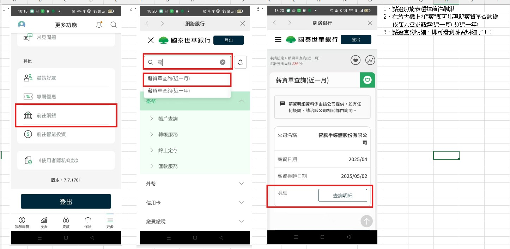

# 持續新增問題中

# 員工常見問題
---
## 如何查詢電子薪資單

---

## 如何使用請假系統

公司請假系統目前使用 Ragic 雲端系統建構。
新進員工 IT 會協助開設帳號。
如忘記密碼請與 IT 聯絡。

---

## 我有多少假？
---
## 如何使用請假
---
## 如何使用加班
---

## 如何從系統知道我還有多少假期

---

## 網路存取
---
### 如何連接公司WiFi？

選擇 wifi 「wisesemi_guest」網路，輸入公司統編 90163588 即可連接。
「wisesemi_oa」「wisesemi_employee」網路，僅允許公司授權裝置連接。
---
### 我忘記了網路密碼，該怎麼辦？

請造訪IT服務台入口網站或聯絡IT部門：itcad@wisesemi.com
---
## 硬體支援
---
### 如何申請新設備？

透過IT服務台入口網站提交申請，並需要您主管的核准。
---
### 如果我的筆電無法正常運作該怎麼辦？

請先重新啟動您的筆電。如果問題持續存在，請聯絡IT服務台分機2500。
---
## 軟體
---
### 如何安裝公司核准的軟體？

從您桌面存取軟體中心，並從可用應用程式中選擇。
---
### 如何申請特定軟體的存取權限？

透過IT服務台入口網站提交軟體存取申請表。
---
## 安全
---
### 我應該多久更換一次密碼？

密碼必須每90天更換一次。系統會在到期前14天開始發送電子郵件提醒。
---
### 如果我懷疑有安全漏洞該怎麼辦？

立即將您的設備與網路斷開連接，並聯絡IT安全團隊：security@wisesemi.com 或分機2525。
---
## 遠端存取
---
### 在遠端工作時如何存取公司資源？

使用安裝在您筆電上的VPN客戶端。連接說明可在IT入口網站上找到。
---
### 我在連接VPN時遇到問題，該怎麼辦？

確保您有穩定的網路連接。如果問題持續存在，請聯絡IT服務台。
---